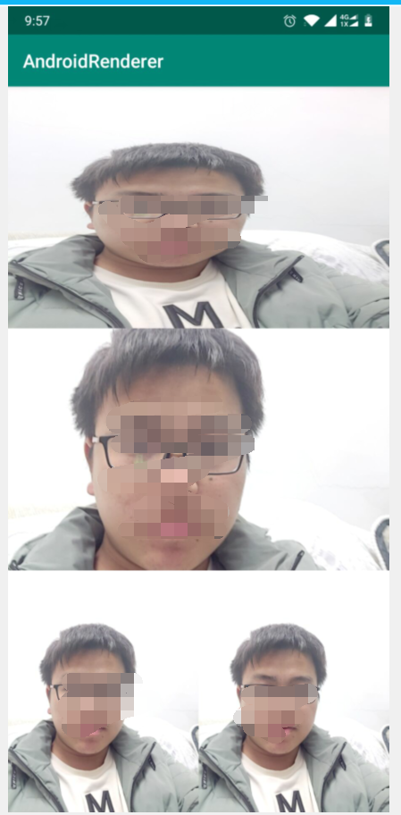

## 目录

* [SurfaceRenderer](#SurfaceRenderer)
* [GlesRendererView](#GlesRendererView)

### SurfaceRenderer

说明: 
SurfaceRenderer是一个基于Android Surface 渲染视频的类库, 核心类是SurfaceRenderer.java, 可以基于它和SurfaceView或TextureView封装一个YUV数据渲染控件

示例: 基于SurfaceRenderer封装的一个YUV渲染控件FrameRendererView

	// 1. 找到控件:
	FrameRendererView rendererView = findViewById(R.id.rendererView);

	// 2.安装控件:参数一表示渲染的视频数据格式, 目前只支持NV21和I420两种格式的数据渲染
	// 参数二及参数三表示数据的宽和高, 参数四表示视频数据的角度[0,90,180,270]
	rendererView.setupRenderer(SurfaceRenderer.FMT_NV21, nv21Width, nv21Height, degree);

	// 3. 刷新nv21帧(在工作线程中调用)
	byte[] nv21Buffer = ...;
	// state == 0表示刷新成功; 其他的表示刷新失败;
	int state = rendererView.refreshFrame(nv21Buffer);

使用到的技术:
1. android ANativeWindow
2. libyuv

效果{多个渲染控件同时渲染画面}:  

[返回目录](#目录)
	
### SurfaceRenderer

基于GlSurfaceView实现的渲染YUV数据的控件

    	// 1. 找到控件:
    	GlesRendererView rendererView = findViewById(R.id.rendererView);
    
    	// 2.安装控件:参数一表示渲染的视频数据格式, 目前只支持NV21和I420两种格式的数据渲染
    	// 参数二及参数三表示数据的宽和高, 参数四表示视频数据的角度[0,90,180,270]
    	rendererView.setupRenderer(SurfaceRenderer.FMT_NV21, nv21Width, nv21Height, degree);
    
    	// 3. 刷新nv21帧(在工作线程中调用)
    	byte[] nv21Buffer = ...;
    	// state == 0表示刷新成功; 其他的表示刷新失败;
    	int state = rendererView.refreshFrame(nv21Buffer);

[返回目录](#目录)